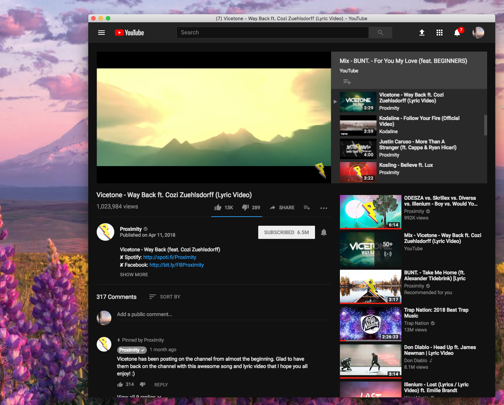

# YouTube-Desktop
Shockingly, the only MacOS desktop client for YouTube with both adblock and session saving.

# Sample Images:



# Dev notes:
```
$ npm install --save electron-ad-blocker # also, install yarn prereq
$ npm install --save electron-window-plus
```

# Building:
``npm run build # calls build field in json file..``
